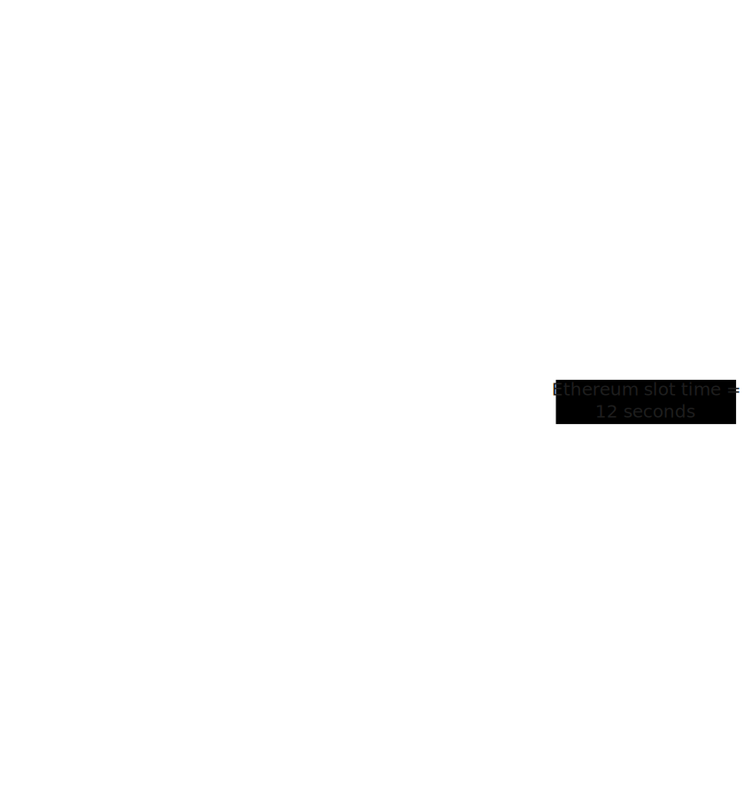

# Preconditions for Integrating zkEVMs
> Note. Section under construction
- are there some changes that we need to make to the Ethereum protocol before we can move to zkEVMs?
- What are the constraints to make this work in practice, e.g., how fast must proving be?
    * define real-time proving here?
- collect a list of open questions that we need to answer before we can have zkEVMs on L1

### Real-Time Proving

A fundamental requirement for integrating zkEVMs directly into Ethereum’s base layer is **real-time proving**: the ability to generate a succinct validity proof for a block within the same slot time in which it is proposed (today, about 12 seconds).

Concretely, this means that after a block is fully assembled — including all transactions and state updates — a prover must generate a proof and share it with validators before the slot ends. The entire process, from finalizing the block contents to outputting and distributing the proof, must be completed within this tight time frame.

In this model, the block proposer first selects transactions from the mempool and assembles the block as usual. Once the block content is fixed, a zkVM runs the block execution logic and produces a compact zk proof attesting that all computations are correct. Validators then verify this succinct proof instead of re-executing the full block themselves.

Since the proof is typically finalized near the end of the slot, validators can quickly verify it before moving on to the next block. This introduces a *deferred execution check*: validators no longer perform full execution upfront but rely on a proof that can be checked very quickly. Despite this shift, Ethereum’s liveness and finality guarantees are maintained because this check still occurs entirely within each slot.

The diagram below summarizes this real-time proving flow:

#### Why Real-Time Proving is Important

In Ethereum today, each validator fully re-executes all transactions in a block before attesting. zkEVMs aim to remove this redundancy by shifting execution to a single prover who produces a succinct proof, while validators verify it cheaply. However, for this paradigm to preserve Ethereum’s liveness and finality guarantees, proofs must be ready **within each slot’s time budget**.

If a proof arrives late — even by a few seconds — validators cannot attest immediately, leading to missed attestations, weaker finality, and increased vulnerability to reorgs. Worse, if slots are missed systematically, it undermines the security assumptions of the beacon chain and the overall Ethereum consensus.

Thus, real-time proving is an **absolute requirement** to replace re-execution at L1 and maintain the same block time and finality cadence.

#### A Standardized Definition for L1

To align the efforts of zkVM teams, a [set of concrete targets](https://blog.ethereum.org/2025/07/10/realtime-proving) that define real-time proving for L1 integration has been recently proposed. These standards ensure that provers are not only fast but also secure, accessible, and practical.

  * **Latency:** A proof must be generated in **≤ 10 seconds** for 99% of mainnet blocks. This leaves a \~2-second buffer within the 12-second slot for network propagation.
  * **Security:** Proofs must provide at least **128 bits of security**. An initial 100-bit level may be acceptable temporarily, but 128 bits is the long-term goal.
  * **Proof Size:** The final proof must be **≤ 300 KiB** and must not rely on recursive wrappers that use trusted setups.
  * **Code:** The entire prover stack must be **fully open source**.

#### Technological Foundations

Achieving real-time proving relies on a combination of cryptographic and engineering advances. At the heart of this effort are special virtual machines called zkVMs, which allow us to run Ethereum’s state transition logic and produce a short proof that the computation was done correctly.

To make proofs fast enough, these zkVMs must be carefully designed to minimize unnecessary work and handle large blocks efficiently. In practice, proving a block requires breaking it into smaller parts that can be processed in parallel and then combined into one final proof. The final proof should also be small enough to be posted onchain.

Hardware plays a critical role as well. Today, proofs are typically generated using powerful multi-node setups equipped with many GPUs, but recent trends show rapid progress. Improvements in parallelization, recursion strategies, and specialized acceleration are pushing proof times lower each year.

Importantly, data preparation steps (like generating execution traces and Merkle paths) also require careful optimization to stay within the time budget. Advances in data fetching, caching strategies, and efficient state access mechanisms all contribute to enabling real-time performance.

#### Guarding Against Prover Killers

Real-time proving must also protect against so-called **prover killer blocks**, blocks that are very hard to prove (see [Threat of Prover Killer Blocks](../external/problemsaddressed.html#threat-of-prover-killer-blocks)). To prevent this, the protocol can set strict time limits for when proofs must be submitted. This forces block builders to make sure their blocks can be proven quickly, avoiding blocks that might slow down or stop the network.

#### Toward Future Slot Times

Ethereum’s long-term roadmap envisions reducing slot times (for example to 6 seconds or even lower), which means proofs will need to be generated even faster. zkEVMs must guarantee that proofs are always ready within these tighter time frames, even for the heaviest blocks — not just on average.

Recent advances show that proving technology is evolving very rapidly. As slot times shorten, proving systems are expected to keep improving in parallel, aiming for proofs in 6 seconds, 3 seconds, or even under 1 second in the future. This makes fast proving a moving target that will continue to push technical progress forward.

#### Decentralization and "Home Proving"

Beyond speed, real-time proving has critical consequences for decentralization. If proof systems require massive GPU clusters or expensive specialized hardware, only a few large operators could run them, introducing new centralization risks.

To address this, the concept of **"home proving"** has become a key goal. This is the effort to make provers so efficient that solo stakers can run them from home, preventing a reliance on a few large, centralized operators. To make this goal tangible, the standardized definition for L1 provers includes specific constraints on hardware and energy costs:

* **On-prem Capital Expenditure (CAPEX):** ≤ $100,000 USD for the necessary hardware.
* **On-prem Power Consumption:** ≤ 10 kW, a limit designed to fit within the power capacity of a standard residential home.

The ultimate goal is to make provers small and efficient enough to run on modest clusters, and eventually even on consumer-grade machines such as powerful desktops or laptops. By making home proving feasible, the network can maintain a high degree of censorship resistance and decentralization, allowing individuals, small organizations, or community groups to participate in proving and supporting a more open and resilient network.
