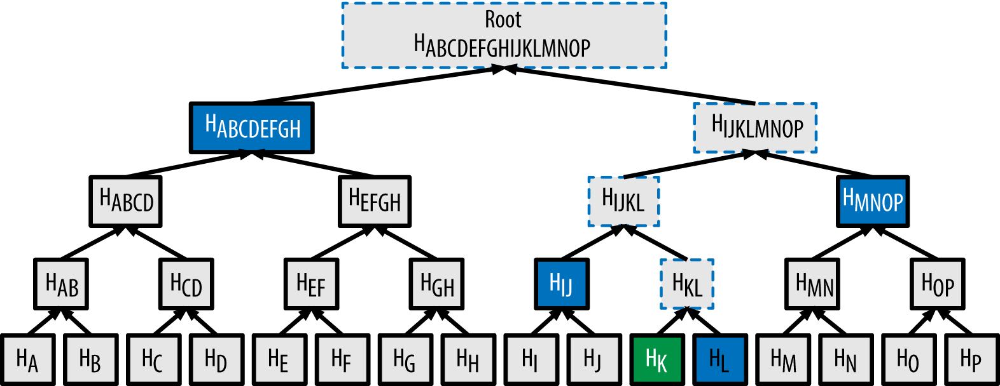

# Cryptographic Layer: The BCS Transform

The **IOP** is a powerful framework for proving a computation's integrity, based on a multi-round conversation between a prover and a verifier. While theoretically robust, this protocol is an abstract blueprint with two features that make it impractical for real-world use on Ethereum:
1.  **It is interactive**, requiring a back-and-forth dialogue.
2.  **Its messages are enormous**, as the prover's "oracles" are very large.

Ethereum requires a proof to be a single, compact piece of data that can be verified quickly without any further communication. To bridge this gap, we use a **cryptographic compiler** to convert the abstract IOP into a concrete, non-interactive proof. The most influential method for this is the [**BCS Transform**](https://eprint.iacr.org/2016/116), named after its creators, Ben-Sasson, Chiesa, and Spooner. It provides an elegant and reliable process for turning an interactive protocol into a single, verifiable argument, denoted as \\(\pi\\).

## Core Cryptographic Tools

The BCS transform achieves this conversion by integrating two fundamental cryptographic techniques: the Fiat-Shamir heuristic to eliminate interaction and Merkle trees to compress the proof data.

### The Fiat-Shamir Heuristic: Eliminating Interaction

In an IOP, the protocol advances when the verifier sends a random message, or *challenge*, to the prover. The **Fiat-Shamir heuristic** is a method to make this process non-interactive.

Instead of relying on a live verifier, a prover in a **public-coin** protocol can generate these challenges for himself in a way that is both deterministic and publicly verifiable. This is accomplished using a cryptographic hash function. The prover takes the entire public transcript of the interaction so far (including public inputs and commitments from previous rounds) and hashes it. The resulting hash output serves as the verifier's *random* challenge for the current round.

Since the hash function is deterministic, anyone can re-compute the same challenges from the same transcript, ensuring the prover cannot cheat by picking favorable challenges. This technique effectively removes the need for a verifier to be present during proof generation, turning the interactive dialogue into a non-interactive process that the prover completes on its own.

### Merkle Trees: Compressing Proof Data

The second challenge is the immense size of the prover's oracle messages. For instance, an oracle can be a list containing millions of polynomial evaluations. Transmitting such a list is impractical.

**Merkle trees** solve this by allowing the prover to commit to a large dataset with a single, small hash value known as the **Merkle root**. The prover places all the values of its oracle message at the leaves of a Merkle tree and generates the root, which now serves as a succinct commitment to the entire oracle.

When the verifier needs to check the value at a specific position (a query), the prover provides only two things:
1.  The value at that specific position (in green in the following diagram).
2.  A short **authentication path**, which consists of the sibling hashes along the path from the value's leaf to the tree's root (in blue in the following diagram).

Using this path, the verifier can re-compute the root and confirm that the provided value is a genuine part of the dataset to which the prover originally committed. This enables succinct verification of oracle data without transmitting the oracle itself.

## The Complete Transformation Process

The full BCS transform combines these two components into a sequential process. The prover simulates the entire IOP internally, round by round, to construct the final proof string \\(\pi\\).

Here is the step-by-step flow:

1.  **Round 1 begins:** The prover takes the public input \\(x\\) and hashes it to generate the verifier's first challenge, \\(m_1\\).
    $$m_1 = HASH(x)$$

2.  **Prover responds and commits:** Using the challenge \\(m_1\\), the prover computes its first oracle message, \\(f_1\\). It then builds a Merkle tree over \\(f_1\\) to produce the first Merkle root, \\(rt_1\\).

3.  **Chaining the rounds:** This step for ensures the integrity of a multi-round protocol. To begin the next round, the prover creates a new protocol state by hashing the new Merkle root with the state from the previous round.
    $$state_1 = HASH(rt_1 || x)$$
    $$m_2 = HASH(state_1)$$

    This **cryptographic chaining** creates a verifiable, ordered sequence. The challenge for round 2 (\\(m_2\\)) depends on \\(state_1\\), which in turn depends on the commitment from round 1 (\\(rt_1\\)). This makes it impossible for a malicious prover to alter the logic or order of the protocol's rounds without breaking the hash chain. This process is where the **binding** property of the Merkle tree comes in: once the prover uses \\(rt_1\\) to generate the challenge for the next round, they are cryptographically bound to the original oracle message of round 1 and cannot change it. This process is repeated for all \\(k\\) rounds of the IOP:
    $$state_i = HASH(rt_i || state_{i-1})$$

4.  **Finalizing the proof:** After the last round, the prover uses the final state, \\(state_k\\), to deterministically generate the positions of all the verifier's queries. The prover then assembles the final proof \\(\pi\\), which contains:
    * All the Merkle roots \\((rt_1, rt_2, ..., rt_k)\\).
    * The values and their corresponding authentication paths for each query.

The verifier receives this single, compact string \\(\pi\\). To validate it, the verifier performs the same sequence of hash computations to regenerate all the challenges and states. It then uses the authentication paths provided in the proof to check if the prover's answers are consistent with the Merkle root commitments for each round. If all checks pass, the proof is accepted.

## Security Implications of the Transform

The BCS transform is highly effective, but it introduces a fundamental shift in the security model. The original IOP possesses **information-theoretic security**, which means that not even a computationally unlimited prover can cheat. The resulting SNARK, however, has **computational security**.

Its soundness now relies on a cryptographic assumption that the hash function used is **secure**. The specific security model for this context is the **Random Oracle Model**, which treats the hash function as an idealized mathematical object. For a formal definition of this model and its implications, we refer the interested reader to the cryptographic literature ([A Graduate Course in Applied Cryptography](https://toc.cryptobook.us/) by Dan Boneh and Victor Shoup, is a good source of information about this).

This shift from an interactive dialogue to a non-interactive proof introduces a new theoretical vulnerability. Because the prover now generates the challenges himself using a hash function, a malicious prover with sufficient computing power could try to "grind" on that function. Grinding is a brute-force attack where the prover rapidly tests slightly different inputs, hoping to find one that produces a "lucky" hash output, i.e. a challenge that makes it easy to create a convincing proof for a false statement.

This non-interactive attack is the direct equivalent of a **state restoration attack** on the original interactive protocol. In a state restoration attack, a prover would theoretically "rewind" the verifier to a previous step to receive a new random challenge, repeating this until they get a lucky one. Grinding simply accomplishes the same goal without a live verifier.

Consequently, the security of the final non-interactive proof is fundamentally limited by the underlying IOP's resilience to these state restoration attacks. This establishes a clear and measurable link: if the original interactive proof is weak against rewinding attacks, the compiled SNARK will be weak against grinding attacks.

This understanding is important because it allows for a **modular design**. Protocol designers can focus on creating an abstract IOP that is provably robust against state restoration, knowing that the BCS transform can then reliably compile it into a practical and secure non-interactive proof.
