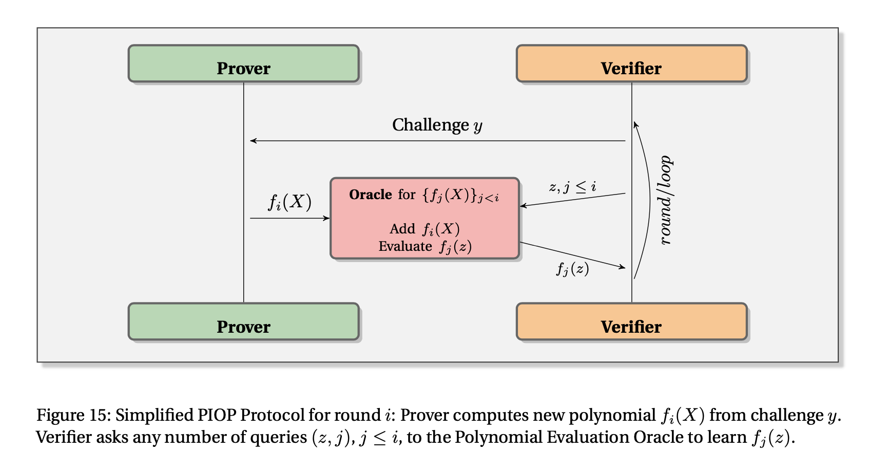

# Information Theoretic Layer: IOPs and Poly-IOPs

After a computation has been transformed into an **Algebraic Intermediate Representation (AIR)**, which defines the set of mathematical rules (as polynomial equations) that a valid computation must follow, the next challenge is for the prover to convince a verifier that they possess a valid **execution trace**, the table recording the machine's state at every single step, that satisfies these rules.

The primary framework used here is the **Interactive Oracle Proof (IOP)**. This entire process represents the middle layer of the modern SNARK design paradigm: first arithmetization, then this information-theoretic protocol, and finally cryptographic compilation.

## Interactive Oracle Proofs (IOPs)

The IOP model is a powerful generalization of the earlier concept of **Probabilistically Checkable Proofs (PCPs)**, designed to be more efficient for building practical proof systems. An **IOP** is a formal protocol between a prover and a verifier that proceeds in rounds:

1.  The **prover** sends a message to the verifier. In the IOP model, this message is treated as an **oracle**, a function that the verifier can query but not read in its entirety.
2.  The **verifier** receives the oracle and, based on previous messages, generates a random challenge and sends it to the prover. The verifier can also make a limited number of queries to the oracles it has received.
3.  This interaction may continue for several rounds. Finally, the verifier decides whether to accept or reject the proof based on the query results.

The key property of an IOP is that its security is **information-theoretic**. This means that a computationally *unbounded* prover cannot cheat the verifier, except with a negligible probability. The security comes from the verifier's randomness, not from any cryptographic hardness assumption.

## Polynomial IOPs (Poly-IOPs)

For zkVMs, we use a specific and highly effective type of IOP called a **Polynomial IOP (Poly-IOP)**. In a Poly-IOP, the oracles sent by the prover are guaranteed to be low-degree polynomials.

This Poly-IOP model is a perfect match for the **AIR arithmetization**:

* The columns of the **execution trace** are interpolated into polynomials.
* The **polynomial constraints** of the AIR become polynomial identities that must be proven (e.g., `A(x) + B(x) - C(x) = 0`).

A Poly-IOP provides the formal steps to prove these identities. For instance, to check if two polynomials `P(x)` and `Q(x)` are identical, the verifier challenges the prover with a random point `r` from a large field and checks if `P(r) = Q(r)`. According to the **[Schwartz-Zippel Lemma](https://en.wikipedia.org/wiki/Schwartz%E2%80%93Zippel_lemma)**, if the polynomials are different, this check will fail with overwhelming probability. STARK proof systems, for example, are fundamentally highly optimized Poly-IOPs.

The following figure is taken from [zk-SNARKs: A Gentle Introduction](https://www.di.ens.fr/~nitulesc/files/Survey-SNARKs.pdf) and illustrates the prover-verifier interaction in a PIOP:

## The Bridge to Concrete SNARKs

An IOP is an abstract mathematical protocol, not a practical proof system. To turn a Poly-IOP into a concrete, real-world SNARK, a process often called a **cryptographic compiler** is applied using two main tools:

1.  **Polynomial Commitment Schemes (PCS):** Instead of sending entire polynomials as oracles (which would be huge), the prover sends a small, cryptographically-binding **commitment** to each polynomial. The PCS then allows the prover to generate proofs that the committed polynomial evaluates to a certain value at specific points, which the verifier can check. This is how **succinctness** is achieved. The choice of PCS is critical, as it directly determines many properties of the final SNARK. For example, using **KZG** results in a system with a trusted setup, while using **FRI** results in a transparent (setup-free) and quantum-resistant system.
2.  **The Fiat-Shamir Heuristic:** To eliminate interaction, the verifier's random challenges are replaced with the output of a cryptographic hash function. The prover simulates the interaction by hashing their own previous messages to generate the next "random" challenge for themself. This makes the proof **non-interactive**.

This modular design is at the heart of most modern SNARK constructions and provides a flexible blueprint for building new proof systems.

### Further Reading

For readers interested in a deeper technical dive into IOPs and their applications, the following resources are highly recommended:

* **[zk-SNARKs: A Gentle Introduction](https://www.di.ens.fr/~nitulesc/files/Survey-SNARKs.pdf)**: A comprehensive survey by Anca Nitulescu that provides a detailed overview of different SNARK constructions, including the PIOP-based framework.
* **[STARKs, Part 1: Proofs with Polynomials](https://vitalik.eth.limo/general/2017/11/09/starks_part_1.html)**: An accessible introduction by Vitalik Buterin explaining the core concepts of using polynomials for proofs.
* **[Scalable, transparent, and post-quantum secure computational integrity](https://eprint.iacr.org/2018/046.pdf)**: The original STARK paper by Ben-Sasson et al., which provides a formal treatment of the IOP model that underpins STARKs.
